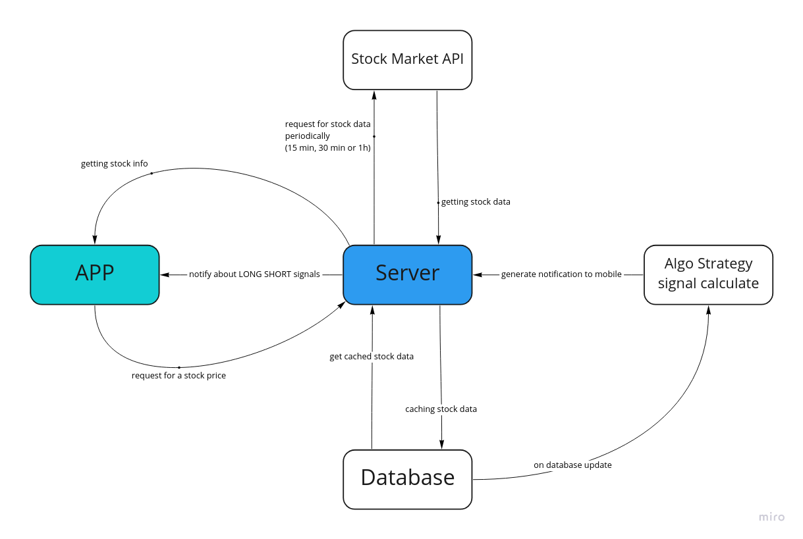

# Stock Price Alerter | Ktor Server

[](https://circleci.com/gh/mobiledevpro/Stock-Price-Alerter-Server/tree/master)

[](https://app.circleci.com/insights/github/mobiledevpro/Stock-Price-Alerter-Server/workflows/heroku_deploy?branch=master)

## Dev plan:

- [x] ~~[Setup Postgres database](https://github.com/mobiledevpro/Stock-Price-Alerter-Server/issues/3)~~
- [x] ~~[Research how to get list of stocks from 3rd party services](https://github.com/mobiledevpro/Stock-Price-Alerter-Server/issues/4)~~
- [x] ~~[Connect to Binance API](https://github.com/mobiledevpro/Stock-Price-Alerter-Server/issues/7)~~
- [x] ~~[Get Binance market coin pairs and save into database](https://github.com/mobiledevpro/Stock-Price-Alerter-Server/issues/8)~~
- [x] ~~[Setup periodic task to update coin pairs in the server database](https://github.com/mobiledevpro/Stock-Price-Alerter-Server/issues/9)~~
- [x] ~~[Create endpoint to GET all available crypto coins with a search filter](https://github.com/mobiledevpro/Stock-Price-Alerter-Server/issues/10)~~
- [x] ~~[Create endpoint to PUT crypto coin to watchlist](https://github.com/mobiledevpro/Stock-Price-Alerter-Server/issues/13)~~
- [x] ~~[Connect to Binance web socket and subscribe on price changes for watchlist](https://github.com/mobiledevpro/Stock-Price-Alerter-Server/issues/17)~~
- [x] ~~[Research how to run tests on Circle CI](https://github.com/mobiledevpro/Stock-Price-Alerter-Server/issues/2)~~
- [X] ~~[Configure CI to run tests once the change is pushed to master](https://github.com/mobiledevpro/Stock-Price-Alerter-Server/issues/6)~~
- [ ] [Create Web Socket to connect mobile app to](https://github.com/mobiledevpro/Stock-Price-Alerter-Server/issues/20)
- [ ] [Create endpoint to PUT alert settings for selected crypto coin](https://github.com/mobiledevpro/Stock-Price-Alerter-Server/issues/14)
- [ ] [Create endpoint to PUT Firebase device token + user uuid to get push-notifications]
- [ ] [Setup Firebase notifications at the server side]
- [ ] [Generate notification to Firebase based on alert settings]


## Logic Scheme



## Run

Execute the following command in a repository's root directory:

```shell
./gradlew run
```

## Deploy to AWS

Doc https://ktor.io/docs/elastic-beanstalk.html#configure-shadow-plugin

Build a JAR and upload it manually via https://aws.amazon.com/ru/console/

```shell
./gradlew :shadowJar
```

## Deploy to Heroku

Doc https://ktor.io/docs/heroku.html#stage

* Create Procfile and add the following content ('com.mobiledevpro.stock-price-alerter' is a projectName from
  settings.gradle.kts)

```shell
web: ./build/install/com.mobiledevpro.stock-price-alerter/bin/com.mobiledevpro.stock-price-alerter
``` 

* Login to Heroku

```shell
heroku login
```

* Create Heroku app

```shell
heroku create stock-price-alerter
```

* Add Heroku remote branch to local machine

```shell
heroku git:remote -a stock-price-alerter
```

* Push your master branch to Heroku

```shell
git push heroku master
```

## Circle CI setup

* Go to [Circle CI](https://app.circleci.com/pipelines/) -> Set Up Project
* Add HEROKU_API_KEY to [Project Settings](https://app.circleci.com/settings/project/) -> Environment Variables
* To get a long-term Heroku API key call the following command:

```shell
heroku authorizations:create
```

## Postgres

* Install locally on Ubuntu https://www.tecmint.com/install-postgresql-and-pgadmin-in-ubuntu/
* Configure Postgres on Heroku:
  * Add your own SSL certificate or upgrade to Heroku paid dyno to use Free SSL (Heroku App -> Settings)
  * Install Add-on "Heroku Postgres" (Heroku app -> Resources)
  * Create tables via PgAdmin.
  * Add the following arg to Config Vars (Heroku App -> Settings):
  ```
  JDBC_URL = jdbc:postgresql://[database host]:[database port]/[database name]?user=[database user]&password=[database user password]&ssl=true&sslfactory=org.postgresql.ssl.NonValidatingFactory&sslmode=require
  ```

## Get in touch

<a href="https://www.instagram.com/mobiledevpro/" target="_blank">
  
</a>

**Dmitriy Chernysh**

[](https://www.instagram.com/mobiledevpro/)
[](https://www.linkedin.com/in/dmitriychernysh/)
[](https://www.upwork.com/o/companies/~01b76ab8954622a7d9/)

## License

Copyright 2022 Dmitriy Chernysh

Licensed under the Apache License, Version 2.0 (the "License");
you may not use this file except in compliance with the License.
You may obtain a copy of the License at

       http://www.apache.org/licenses/LICENSE-2.0

Unless required by applicable law or agreed to in writing, software
distributed under the License is distributed on an "AS IS" BASIS,
WITHOUT WARRANTIES OR CONDITIONS OF ANY KIND, either express or implied.
See the License for the specific language governing permissions and
limitations under the License.

